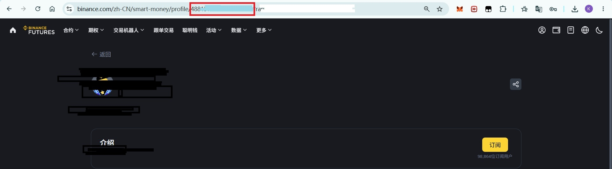

# Binance Smart Copy (跟单机器人)

<p align="center">
  <a href="#english"><strong>English</strong></a> | <a href="#chinese"><strong>中文</strong></a>
</p>

<p align="center">
  
</p>

<p align="center">
  
  
  
</p>


<p align="center">
  
</p>

---

<a name="english"></a>

## English

This is a sample script for following Binance Futures "smart money" position changes and automatically opening/closing positions.

### Main Files
- `binance-smart-copy.py`: Main script containing credential capture, position fetching, order execution, and logging logic.
- `requirements.txt`: Python dependency list.
- `trade_history.csv`: Trade log generated at runtime (auto-created on first run).

**Note**: This repository is for educational and demonstration purposes only. Automated trading carries significant risk — test thoroughly in a controlled environment with small capital before real use.

### Quick Start

1. Clone or download this repository to your local machine.
2. Create a `.env` file in the repository root (see template below).
3. Install dependencies and download the Playwright browser in PowerShell:

```powershell
python -m pip install -r requirements.txt
playwright install
```

4. Run the script:

```powershell
python binance-smart-copy.py
```

On first run, if `BINANCE_COOKIE` / `BINANCE_CSRFTOKEN` are not set in `.env`, the script will open a Playwright persistent browser window. Log in to Binance manually and navigate to the "Smart Money" positions page. Once confirmed, return to the terminal and type `yes` to save your credentials to `.env`.

### `.env` Template (Example)

```
API_KEY=your_binance_api_key
API_SECRET=your_binance_api_secret
TOP_TRADER_ID=target_trader_encryptedUid
PROXY_PORT=(optional) local proxy port, e.g. 1080

MY_TOTAL_CAPITAL=50
MAX_USDT_PER_ORDER=15
MIN_USDT_PER_ORDER=10
FORCE_MIN_ORDER=True
POLL_INTERVAL=10

BINANCE_COOKIE=
BINANCE_CSRFTOKEN=
```

- `API_KEY` / `API_SECRET`: Required for calling Binance API.
- `TOP_TRADER_ID`: The trader ID to track (used as a parameter when querying the smart money page).
  **How to find a trader's ID** (only public-position traders are supported):
  
- `PROXY_PORT`: Optional. Routes `requests` and `python-binance` traffic through `http://127.0.0.1:PROXY_PORT`.

### Configurable Risk Control Parameters

- `MY_TOTAL_CAPITAL`: Your total capital (used to calculate position sizing proportionally).
- `MAX_USDT_PER_ORDER`: Maximum USDT notional value per order.
- `MIN_USDT_PER_ORDER`: Minimum USDT notional value per order.
- `FORCE_MIN_ORDER`: Whether to boost order value to the minimum when the calculated size falls below `MIN_USDT_PER_ORDER`.
- `POLL_INTERVAL`: Polling interval in seconds.

### Logging

Trade activity is recorded to `trade_history.csv`, including timestamp, operation type, trading pair, direction, quantity, notional value, leverage, and notes.

### Runtime Interaction

On first run, if `BINANCE_COOKIE` / `BINANCE_CSRFTOKEN` are missing, the script opens a Chromium persistent context window. Log in to Binance and navigate to the "Smart Money" positions page. Once the page loads, return to the terminal and type `yes` to save credentials.

### Security & Risk Notice

- Do not push your `.env` file containing real `API_KEY`/`API_SECRET` to remote repositories.
- Automated trading involves market risk, API rate limits, network failures, and credential expiry risks. Paper trading or small-amount testing is strongly recommended.
- This sample script does not include comprehensive error recovery, order confirmation, or advanced risk control strategies. Extend and audit it yourself before live trading.

### Common Issues & Troubleshooting

- If position fetching returns a credential error, the script will attempt to re-open the browser for re-login and update `BINANCE_COOKIE`/`BINANCE_CSRFTOKEN` in `.env`.
- When using a proxy, ensure the local proxy is running and `PROXY_PORT` is set correctly.

### Suggested Improvements

- Add more robust retry logic and alerting (e.g., email/Telegram).
- Support testnet/sandbox mode for safer strategy validation.
- Add a dry-run mode that logs without submitting real orders.

### Contact

weimr30@gmail.com — for help or feature requests, let me know what changes you'd like.

### Risk Warning

**Warning**: This tool is for quantitative trading technology exchange and learning purposes only and does not constitute investment advice. Cryptocurrency futures trading is highly risky. Ensure you fully understand and configure risk control parameters (such as `MAX_USDT_PER_ORDER`) before use. The author assumes no legal liability for any asset losses incurred from copy trading.

---

<a name="chinese"></a>

## 中文

这是一个用于跟随币安合约"聪明钱"持仓变化并自动开/平仓的示例脚本。

### 主要文件
- `binance-smart-copy.py`：主脚本，包含凭证抓取、持仓抓取、开/平仓、日志持久化等逻辑。
- `requirements.txt`：Python 依赖列表。
- `trade_history.csv`：运行时生成的交易日志（首次运行会自动创建）。

**注意**：本仓库仅作学习与示例用途。自动化交易有显著风险，请在受控环境和小资金下充分测试。

### 快速开始

1. 克隆或下载本仓库到本地。
2. 在仓库根目录创建一个 `.env` 文件（示例模板见下）。
3. 在 PowerShell 中安装依赖并下载 Playwright 浏览器：

```powershell
python -m pip install -r requirements.txt
playwright install
```

4. 运行脚本：

```powershell
python binance-smart-copy.py
```

在首次运行并且 `BINANCE_COOKIE` / `BINANCE_CSRFTOKEN` 未在 `.env` 中时，脚本会弹出 Playwright 持久化浏览器窗口，要求你手动登录币安并进入"聪明钱"持仓页面。登录并确认页面加载后，回到终端输入 `yes` 以保存凭证到 `.env`。

### `.env` 模板（示例）

```
API_KEY=your_binance_api_key
API_SECRET=your_binance_api_secret
TOP_TRADER_ID=目标交易员的 encryptedUid
PROXY_PORT=（可选）本地代理端口，例如 1080

MY_TOTAL_CAPITAL=50
MAX_USDT_PER_ORDER=15
MIN_USDT_PER_ORDER=10
FORCE_MIN_ORDER=True
POLL_INTERVAL=10

BINANCE_COOKIE=
BINANCE_CSRFTOKEN=
```

- `API_KEY` / `API_SECRET`：用于调用币安 API（必须）。
- `TOP_TRADER_ID`：要跟踪的交易员 ID（脚本用于查询"聪明钱"页面时的参数）。
  交易员ID查看方法（仅支持公开持仓交易员）：
  
- `PROXY_PORT`：可选，将会把 `requests` 和 `python-binance` 的请求代理到 `http://127.0.0.1:PROXY_PORT`。

### 可配置的风控参数

- `MY_TOTAL_CAPITAL`：你的总资金（用于按比例计算跟随仓位）。
- `MAX_USDT_PER_ORDER`：单笔订单最大 USDT 价值限制。
- `MIN_USDT_PER_ORDER`：单笔最小 USDT 价值限制。
- `FORCE_MIN_ORDER`：当理论订单低于最小值时是否强制提升。
- `POLL_INTERVAL`：轮询间隔（秒）。

### 日志

交易行为会记录到 `trade_history.csv`，包含时间、操作类型、交易对、方向、数量、价值、杠杆与备注。

### 运行时交互

首次运行若缺少 `BINANCE_COOKIE` / `BINANCE_CSRFTOKEN`，脚本会打开一个 Chromium 持久化上下文窗口，要求你登录币安并进入"聪明钱"页面。完成后在终端输入 `yes` 以保存凭证。

### 安全与风险提示

- 请勿将含有 `API_KEY`/`API_SECRET` 的 `.env` 推送到远程仓库。
- 自动化交易存在市场风险、API 风控、网络故障和凭证失效风险。强烈建议在纸面交易或小额度下充分测试。
- 本脚本示例没有完善的异常恢复、订单确认或复杂风控策略，请在真实交易前自行扩展与审核。

### 常见故障与建议

- 如果抓取持仓返回凭证失效，脚本会尝试重新打开浏览器让你重新登录并更新 `.env` 中的 `BINANCE_COOKIE`/`BINANCE_CSRFTOKEN`。
- 若使用代理，请确保本地代理可用并且 `PROXY_PORT` 填写正确。

### 后续改进建议

- 增加更严格的失败重试与告警机制（例如邮件/Telegram）。
- 支持沙盒/测试网模式以便更安全地验证逻辑。
- 增加 dry-run 模式仅记录而不提交真实订单。

### 联系方式

weimr30@gmail.com —— 如需帮助或需要我协助添加功能，请告诉我你想要的改动。

### 风险提示

**警告**：本工具仅供量化交易技术交流与学习使用，不构成任何投资建议。加密货币合约交易具有高风险性，请务必在充分了解并配置好风控参数（如 `MAX_USDT_PER_ORDER`）后再行使用。因跟随交易产生的任何资产损失，作者不承担任何法律责任。
